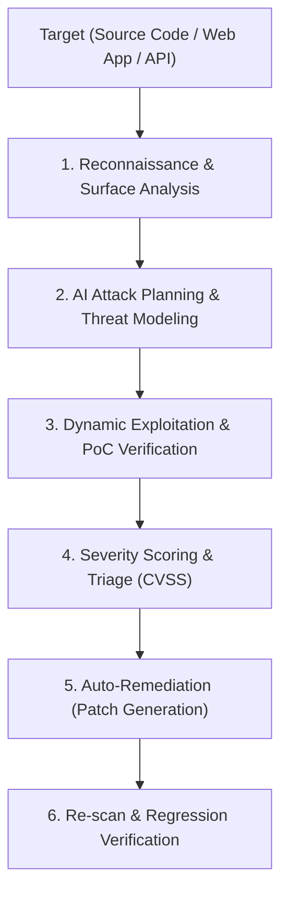

# Strix - Autonomous AI Security & Penetration Testing

Strix (`usestrix/strix`) is an autonomous AI penetration testing agent designed to find, validate with working Proof-of-Concept (PoC) exploits, and remediate security vulnerabilities across codebases, web applications, and APIs.

---

## 1. When to Use Strix

Activate Strix workflows whenever:
- Performing security assessments or penetration tests on web applications, REST/GraphQL APIs, or backend services.
- Analyzing source code for security vulnerabilities (SQL Injection, XSS, SSRF, IDOR, Broken Authentication, CSRF, RCE, Insecure Deserialization).
- Validating whether a reported vulnerability is a genuine exploit vs. a false positive via dynamic PoC verification.
- Applying minimal, secure, and regression-free patches to remediate security vulnerabilities.
- Setting up automated security verification in CI/CD pipelines.

---

## 2. Core Capabilities & Workflows



### 2.1. Autonomous Penetration Testing
1. **Target Specification**: Scan local directory, remote git repo, or live staging/dev URL.
2. **Tool Execution**: Runs security probes, payload injections, and dynamic fuzzing within isolated execution environments.
3. **PoC Exploit Generation**: Produces verifiable steps and payload scripts to demonstrate the exploit without causing service degradation.

### 2.2. Automated Remediation & Patching
1. **Root-Cause Analysis**: Identifies exact line numbers, vulnerable functions, and missing input sanitizers / access controls.
2. **Minimal Patching**: Implements targeted code changes to eliminate the vulnerability while preserving functional logic.
3. **Verification**: Re-evaluates the vulnerability against the updated code to ensure the attack surface is completely neutralized.

---

## 3. CLI Commands & Execution

When running Strix locally (via `strix-agent` CLI or Docker container):

```bash
# Run security scan on the current codebase
strix --target .

# Run scan on a live development/staging URL
strix --target http://localhost:3000

# Scan specific API endpoint with authentication token
strix --target http://localhost:3000/api --headers "Authorization: Bearer <token>"

# Generate remediation fixes for identified issues
strix fix --findings findings.json

# Run headless security checks for CI/CD
strix scan --ci --output-format json --output report.json
```

---

## 4. Environment & Provider Configuration

Configure the underlying LLM provider for Strix via environment variables:

```bash
# LLM Provider & Model Selection
export STRIX_LLM="openai/gpt-4o"          # Options: openai/*, anthropic/*, google/*, openrouter/*
export LLM_API_KEY="your-llm-api-key"

# Optional: Set target sandbox limits
export STRIX_SANDBOX_TIMEOUT="600"
export STRIX_MAX_DEPTH="5"
```

---

## 5. Security & Safety Guidelines

- **Authorization**: Only run penetration tests against codebases, domains, and systems you own or have explicit written permission to assess.
- **Data Protection**: Never transmit production credentials, real patient PII, or confidential secrets to unvetted third-party analysis services.
- **Safe Testing**: Always prefer running tests against staging/test environments rather than live production databases.
