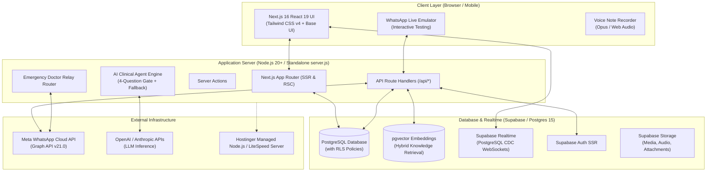
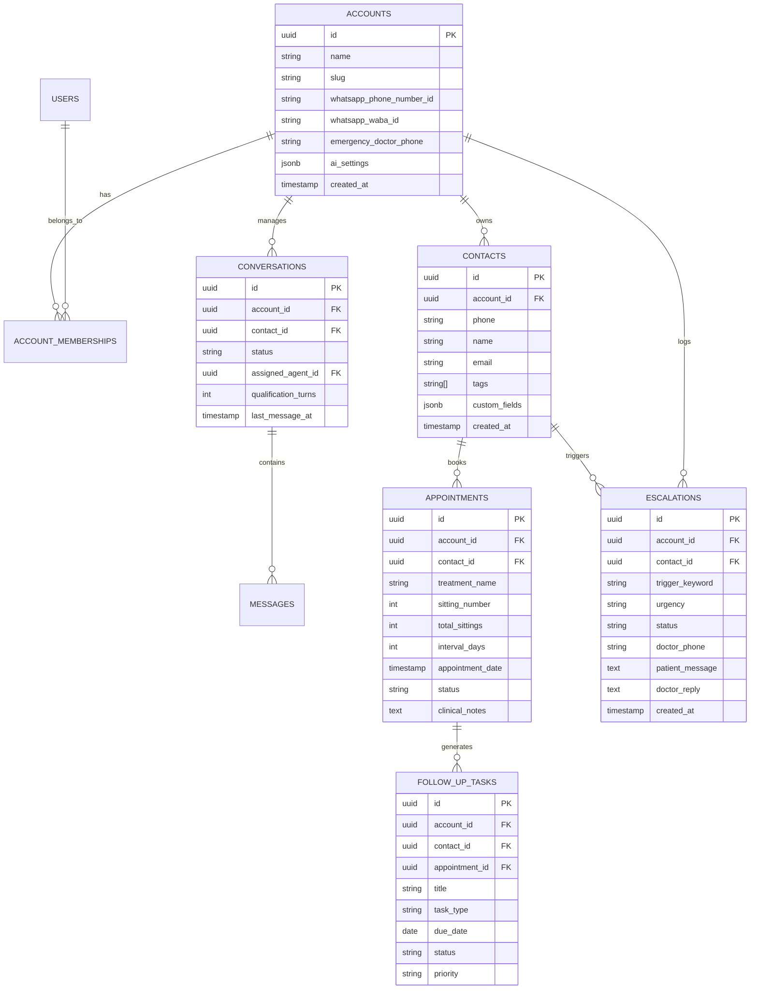
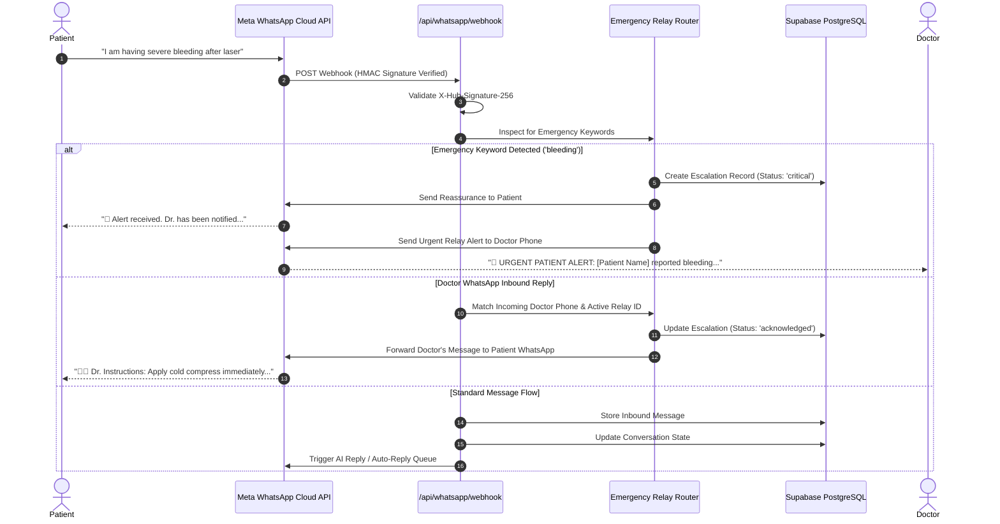
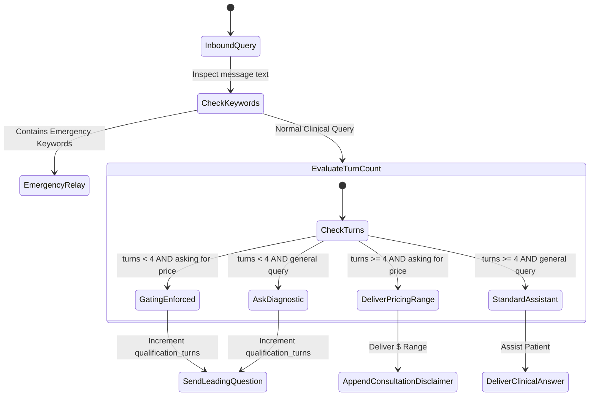

# System Architecture & Technical Specifications — WhatsApp Hospital & Clinical CRM

## 1. High-Level System Architecture

The WhatsApp Hospital CRM (`wacrm`) is built on a modern, decoupled architecture combining a Next.js 16 App Router application with Supabase (PostgreSQL 15 + RLS + Auth + pgvector) and the official Meta WhatsApp Business Cloud API.



---

## 2. Directory Structure & Layer Mapping

```
├── .memory/                     # Local persistent memory context
├── public/                      # Static assets, logos, and sound effects
├── src/
│   ├── app/                     # Next.js App Router
│   │   ├── (auth)/              # Authentication routes (login, register, forgot-password)
│   │   ├── (dashboard)/         # Protected CRM workstation routes
│   │   │   ├── appointments/    # Multi-sitting appointment scheduler & calendar
│   │   │   ├── automations/     # Visual workflow builder
│   │   │   ├── broadcasts/      # Campaign sender & HSM template manager
│   │   │   ├── contacts/        # Patient CRM directory & medical tags
│   │   │   ├── dashboard/       # Executive metrics & live activity feed
│   │   │   ├── escalations/     # Emergency doctor relay console & audit logs
│   │   │   ├── follow-ups/      # Multi-sitting recovery task queue
│   │   │   ├── notifications/   # System alerts & emergency notice center
│   │   │   ├── pipelines/       # Kanban patient stage funnel
│   │   │   ├── reports/         # Clinical & financial analytics
│   │   │   ├── settings/        # WhatsApp creds, AI keys, team RBAC, system config
│   │   │   └── templates/       # Meta-approved message template editor
│   │   ├── api/                 # Backend REST endpoints & Webhooks
│   │   │   ├── ai/              # AI test, generation & embeddings
│   │   │   ├── appointments/    # Sittings CRUD & task triggers
│   │   │   ├── automations/     # Workflow executor
│   │   │   ├── broadcasts/      # Campaign queue dispatcher
│   │   │   ├── escalations/     # Emergency triage & doctor bridge
│   │   │   ├── follow-ups/      # Recovery task management
│   │   │   ├── v1/              # Public developer REST API
│   │   │   └── whatsapp/        # Meta webhook receiver & verification
│   ├── components/              # Modular UI components
│   │   ├── layout/              # Sidebar, header, notifications dropdown
│   │   ├── ui/                  # Accessible primitives (shadcn / Base UI)
│   │   └── ChatEmulator.tsx     # Full WhatsApp interactive preview & testing
│   ├── hooks/                   # Custom client hooks (use-auth, use-demo-state)
│   ├── lib/                     # Core business logic & SDK abstractions
│   │   ├── ai/                  # generate-reply.ts (4-question gating, pricing range)
│   │   ├── supabase/            # client.ts, server.ts, admin.ts (Service Role)
│   │   └── whatsapp/            # meta-api.ts, emergency-relay.ts, encryption.ts
│   └── types/                   # TypeScript schemas and database interfaces
├── supabase/
│   └── migrations/              # 38+ SQL migrations defining tables, RLS & triggers
├── server.js                    # Standalone Node.js server for Hostinger / VPS
└── .htaccess                    # LiteSpeed web server reverse proxy & caching rules
```

---

## 3. Database Schema & Data Models

All database tables reside in PostgreSQL with Row Level Security (RLS) ensuring strict multi-tenant isolation keyed by `account_id`.



---

## 4. WhatsApp Webhook & Emergency Relay Pipeline



---

## 5. AI Inference & 4-Question Qualification Subsystem



### Key Technical Guardrails:
1. **Model Support**: OpenAI (`gpt-4o`, `gpt-4o-mini`), Anthropic (`claude-3-5-sonnet`), or local LLM gateways.
2. **Deterministic Encryption**: API tokens stored encrypted via AES-256-GCM using `ENCRYPTION_KEY`.
3. **Retrieval**: Knowledge base chunks fetched via PostgreSQL full-text search (`tsvector @@ websearch_to_tsquery`) or cosine distance on vector embeddings (`embedding <=> query_embedding`).

---

## 6. Hostinger & Standalone Server Deployment Topology

The application is engineered to deploy seamlessly on **Hostinger Managed Node.js** (or any Ubuntu/Debian VPS / Docker container) via a custom standalone server runtime:

```
[Internet]
   │ HTTPS (Port 443)
   ▼
[LiteSpeed Web Server (.htaccess)]
   │ Reverse Proxy Rewrite Rules (Pass-through WebSockets & API)
   ▼
[Custom server.js (Node.js 20+ Standalone Runtime)]
   │ Binds to process.env.PORT || 3000
   ▼
[Next.js App Router / SSR Handlers]
```

### Deployment Configuration Highlights:
- **`server.js`**: Lightweight HTTP listener utilizing Next.js standalone output to serve dynamic routes without external orchestrators.
- **`.htaccess`**: LiteSpeed rules enabling Brotli/Gzip compression, caching static `.next/static` assets at edge, and proxying HTTP requests to the local Node process.
- **`package-deploy.js`**: Deployment packager that builds the standalone bundle and outputs a zero-overhead zip ready for hPanel upload.
