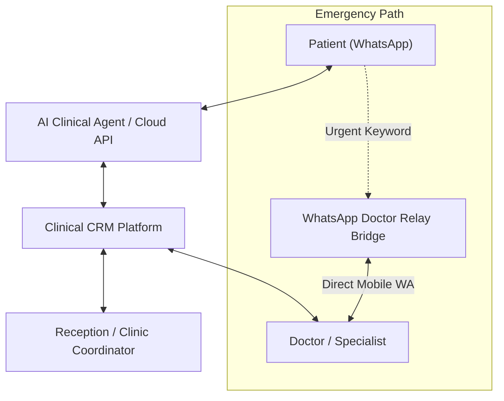
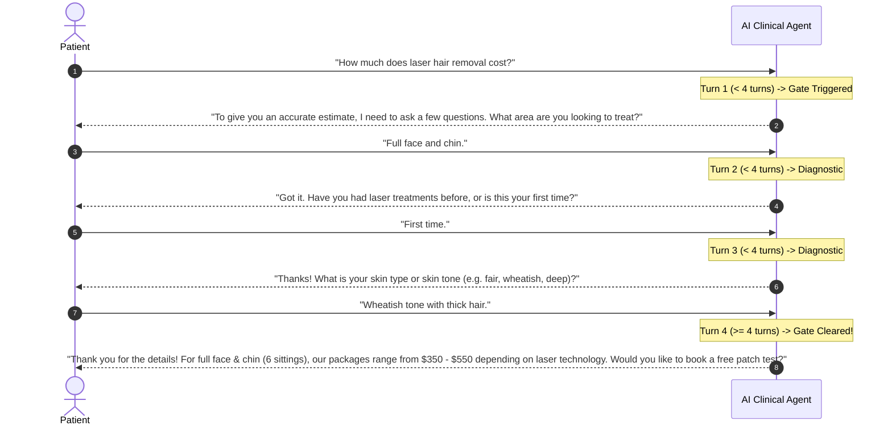

# Product Requirements Document (PRD) — WhatsApp Hospital & Clinical CRM

## 1. Executive Summary & Vision

**WhatsApp Hospital & Clinical CRM (`wacrm`)** is a dedicated clinical management and customer relationship system engineered specifically for healthcare providers, aesthetic clinics, dermatology centers, and dental practices.

By converting the official Meta WhatsApp Business Cloud API into a full-featured clinical workstation, the platform enables medical staff to conduct consultations, automate multi-sitting treatment plans, triage clinical emergencies in real-time, qualify patient pricing inquiries, and execute compliant broadcast outreach—all while maintaining complete patient data ownership.

---

## 2. Target Personas & User Journeys

### 2.1. The Specialist / Doctor
- **Needs**: Instant notification of clinical complications (bleeding, infections, severe pain); ability to review patient treatment progress across sittings; ability to reply directly to emergencies from their personal WhatsApp without exposing their personal phone number to the patient.
- **Key Flow**: Receives WhatsApp alert from CRM bridge -> Replies to WhatsApp message -> CRM relays doctor's instructions to patient and marks escalation as acknowledged.

### 2.2. The Clinic Coordinator / Receptionist
- **Needs**: Unified inbox to manage patient chats across all staff; single-click appointment scheduling with automated multi-sitting interval tracking; clear visibility into daily due follow-ups.
- **Key Flow**: Opens `/appointments` -> Schedules Sitting 1 -> When patient finishes, clicks "Schedule Next Sitting" -> System automatically sets date based on clinical protocol (e.g. +4 weeks) -> Follow-up queue populated.

### 2.3. The Patient / Prospective Client
- **Needs**: Rapid answers to treatment queries on WhatsApp; transparent approximate pricing without feeling dismissed; warm, guided diagnostic questions; timely pre/post-procedure care instructions.
- **Key Flow**: Texts clinic inquiring about acne scar treatment -> AI asks 4 diagnostic questions to understand severity and skin type -> AI delivers price range with consultation disclaimer -> Patient books consultation slot.

### 2.4. The Clinic Administrator / Owner
- **Needs**: Complete data ownership; zero per-seat subscription markup; custom AI keys (OpenAI / Anthropic); compliance logs; high deliverability broadcasts.

---

## 3. Core Functional Requirements

### 3.1. Multi-Sitting Treatment & Interval Management

Clinics perform procedural treatments that require multiple sessions spaced out over exact medical intervals. The CRM must track sitting progression, calculate optimal future dates, and maintain recovery follow-ups.

#### Standard Clinical Protocols Matrix
| Treatment Name | Default Sittings | Protocol Interval | Follow-up Tasks Triggered |
| :--- | :--- | :--- | :--- |
| **Laser Hair Reduction** | 6 Sittings | 4–6 Weeks (28–42 days) | Pre-care shaving guide (Day -1), Sunscreen check (Day +3), Next sitting reminder (Week -1) |
| **PRP Therapy (Hair / Skin)**| 4 Sittings | 3–4 Weeks (21–28 days) | Post-procedure tenderness check (Day +1), Hydration advisory (Day +3) |
| **Chemical Peels** | 4 Sittings | 2–3 Weeks (14–21 days) | Peeling status check (Day +2), Barrier repair reminder (Day +5) |
| **Microneedling RF** | 4 Sittings | 3–4 Weeks (21–28 days) | Redness check (Day +1), Post-treatment recovery review (Day +7) |
| **HydraFacial Glow** | 3 Sittings | 4 Weeks (28 days) | Glow maintenance check (Day +7), Next sitting booking (Day +21) |
| **Botox & Dermal Fillers** | 1 Sitting | 2 Weeks (14 days) | Asymmetry & touch-up review (Day +14) |

#### Functional Requirements:
1. **Sitting Progress Tracking**: Each appointment record displays sitting progress (e.g., `Sitting 2/6`) with visual progress badges.
2. **Auto-Interval Scheduler**: "Schedule Next Sitting" modal pre-populates the target appointment date by adding the protocol interval to the completed sitting date.
3. **Automated Follow-Up Queue**: Completing a sitting automatically inserts scheduled recovery tasks into the `/follow-ups` queue.
4. **Treatment Plans Overview**: Staff can view the full session history per patient in the contact profile drawer.

---

### 3.2. Emergency Protocol & WhatsApp Doctor Relay Bridge

Medical emergencies and acute post-procedure reactions require immediate doctor intervention without requiring the doctor to be logged into the web CRM.

#### Functional Requirements:
1. **Keyword Triage Engine**: Detects high-priority triggers in inbound WhatsApp messages:
   - *Emergency Keywords*: `urgent`, `severe pain`, `bleeding`, `infection`, `fever`, `swelling`, `pus`, `allergic reaction`, `difficulty breathing`, `emergency`.
2. **Automated Patient Reassurance**: Instantly dispatches a priority automated WhatsApp reply:
   > *"🚨 EMERGENCY ALERT RECEIVED: Our clinical team has been alerted immediately. If you are experiencing difficulty breathing or uncontrollable bleeding, please call emergency services right away. Dr. [Name] has been notified and will respond shortly."*
3. **Doctor Mobile Dispatch**: Formats and transmits a high-priority WhatsApp template to the doctor's registered mobile number containing:
   - Patient Name & Phone Number
   - Triggering Message & Detected Symptoms
   - Sitting history & Recent Treatment Name
   - Relay ID token for reply matching
4. **Two-Way Doctor Mobile Relay**:
   - The doctor replies directly to the WhatsApp message on their personal phone.
   - The CRM webhook intercepts the doctor's incoming WhatsApp message, parses the destination patient context, and forwards the message directly to the patient's WhatsApp thread.
   - The escalation record is updated to `status: 'acknowledged'` or `'resolved'` with full audit logging.
5. **Live Escalations Console (`/escalations`)**:
   - Real-time dashboard showing all active escalations, priority levels (`critical`, `urgent`, `medium`), response times, and live relay logs.

---

### 3.3. 4-Question Diagnostic Gating & Pricing Range Engine

To prevent unqualified price shopping while maintaining medical credibility, the AI agent must enforce a 4-question clinical diagnostic gate before sharing pricing.

#### Functional Requirements:
1. **Turn Counter & State Persistence**: Tracks conversation depth per patient in Supabase (`metadata.qualification_turns`).
2. **Pricing Defense**: If the patient asks for price on Turns 1–3, the AI provides a friendly explanation that pricing depends on individual skin/hair condition and asks the next diagnostic question.
3. **Approximate Price Range Delivery**: On Turn 4+, the AI provides a realistic approximate range (never an absolute quote) and appends a consultation requirement disclaimer.
4. **Proactive Diagnostic Leading**: If the patient sends ambiguous or short responses ("yes", "ok", "tell me more"), the AI automatically sends the next relevant diagnostic leading question to qualify the lead.

---

### 3.4. Shared WhatsApp Inbox & Multi-Agent Collaboration

1. **Official WhatsApp Business Cloud API**: Direct Meta Graph v21.0 integration with native support for text, images, documents, audio voice notes, interactive buttons, and list messages.
2. **Team Inbox**: Multi-agent shared mailbox with conversation assignment, status filters (`open`, `pending`, `resolved`), and internal private notes.
3. **Realtime Webhooks**: Instant message synchronization using Supabase Realtime and WebSocket listeners.
4. **Agent Collision Detection**: Live presence indicator showing when another agent or doctor is actively viewing or typing in a conversation.

---

### 3.5. Visual Automation Builder

1. **Triggers**: Inbound Message Received, Keyword Match, Contact Created, Appointment Booked, Status Changed.
2. **Actions**: Send WhatsApp Message, Send HSM Template, Add/Remove Tags, Create Follow-up Task, Delay Wait (e.g., Wait 2 hours), Webhook POST.
3. **No-Code Canvas**: Drag-and-drop / node-based workflow builder with live testing and execution logs.

---

### 3.6. Broadcast Campaigns & Meta HSM Templates

1. **Meta Template Synchronization**: Create, edit, and sync Meta-approved HSM message templates directly from the CRM.
2. **Variable Substitution**: Dynamic variable mapping (`{{1}}` -> Patient First Name, `{{2}}` -> Appointment Date).
3. **Segmented Campaigns**: Send targeted broadcasts to filtered contact lists (e.g. "PRP Patients overdue for Sitting 3").
4. **Delivery & Read Analytics**: Real-time tracking of sent, delivered, read, and failed counts.

---

## 4. Non-Functional Requirements

### 4.1. Performance & Scalability
- Webhook response latency < **1500ms** (acknowledges Meta with 200 OK immediately, processes pipeline asynchronously).
- CRM page load (LCP) < **1.2 seconds** on standard broadband.
- Standalone Node.js server footprint < **180MB RAM** during active polling.

### 4.2. Security & Compliance
- **AES-256-GCM Encryption**: All Meta WhatsApp access tokens, webhook secrets, and LLM API keys stored encrypted in the database.
- **Row-Level Security (RLS)**: Enforced across 100% of PostgreSQL tables to ensure absolute tenant isolation.
- **HMAC SHA-256 Signature Verification**: Inbound webhooks verified against the registered Meta App Secret.

### 4.3. Reliability & Availability
- Zero data loss on webhook spikes via database-backed idempotency logs.
- Automatic fallback to PostgreSQL full-text search if vector embedding API is unavailable.
- Self-contained packaging for one-click deployment on standard Node.js hosts (Hostinger, VPS, Docker).
